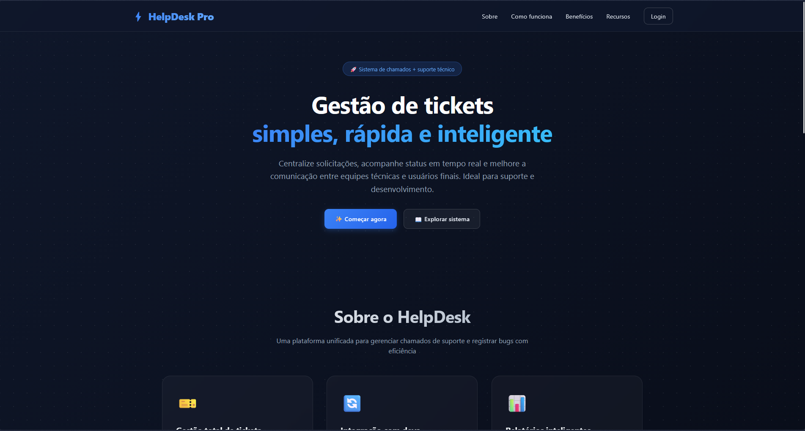
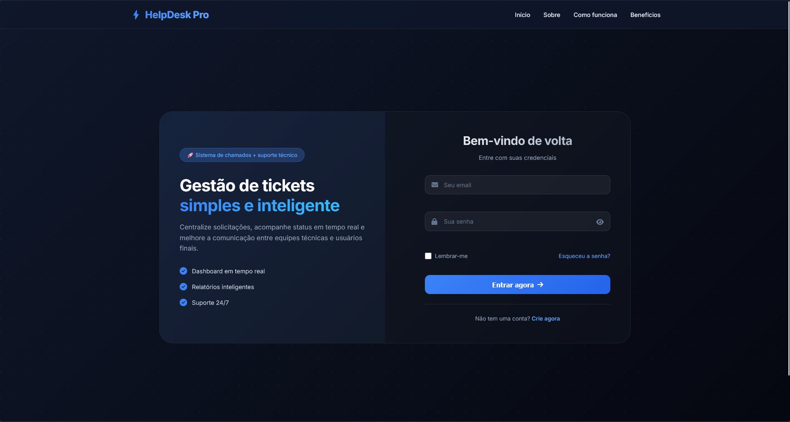
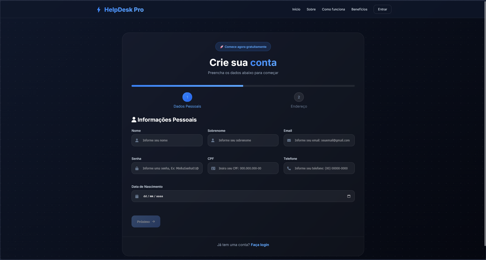
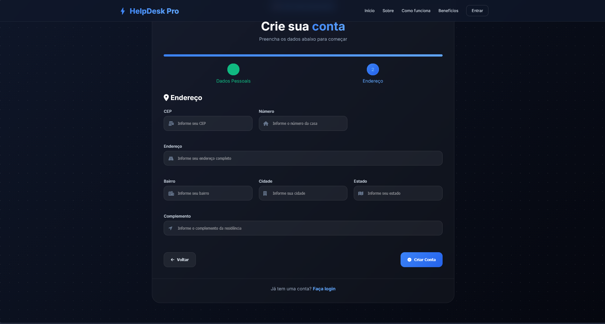
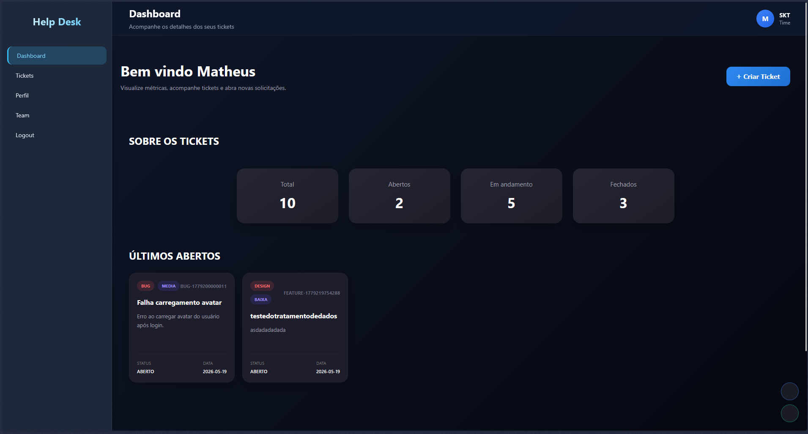
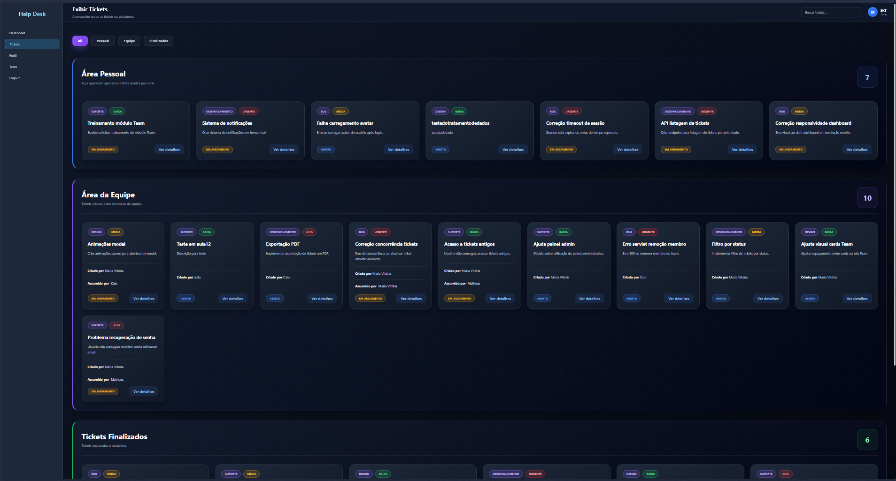
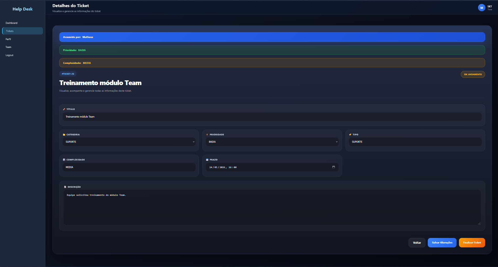
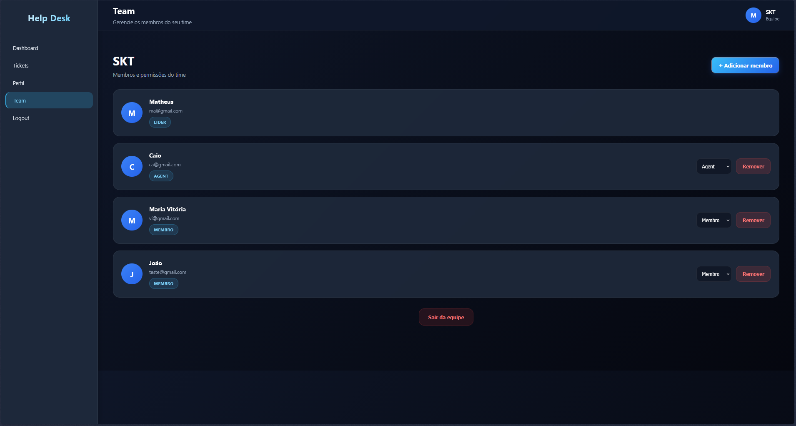
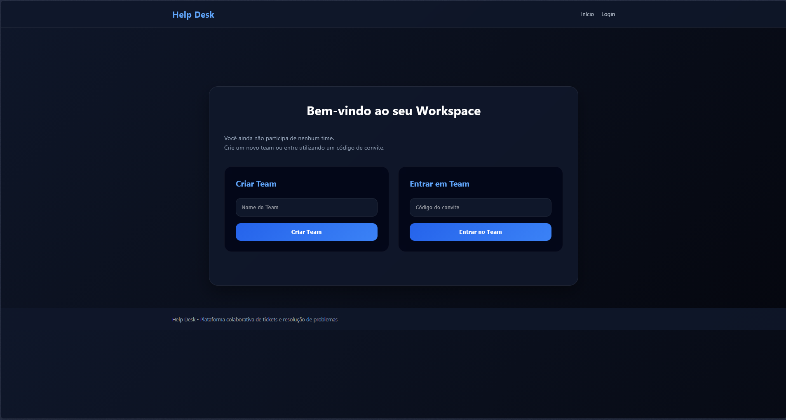

# 🎯 Help Desk System

Sistema web de **Help Desk** desenvolvido com **Java EE**, **Servlets**, **JSP**, **Hibernate** e **MariaDB** — focado no gerenciamento de tickets, autenticação de usuários e organização de equipes de suporte técnico.

---

## 📌 Objetivo do Projeto

Organizar o fluxo de atendimento técnico por meio de **tickets**, permitindo que os usuários possam:

- ✅ Abrir chamados  
- 📍 Acompanhar o andamento do atendimento  
- 👥 Gerenciar equipes  
- 🏷️ Controlar status dos tickets  
- 📊 Visualizar métricas através de um **dashboard**

> Projeto desenvolvido como parte do módulo de **Java EE** da **Step**, com ênfase em arquitetura web, persistência de dados e fluxos corporativos.

---

## 🧰 Stack Utilizada

### 🔧 Backend
- Java EE  
- Servlets  
- Hibernate (ORM)

### 🎨 Frontend
- JSP  
- HTML  
- CSS  
- JavaScript

### 🗄️ Banco de Dados
- MariaDB

---

## 🧱 Arquitetura do Projeto

Estruturado com uma arquitetura **MVC simplificada**:

| Camada     | Responsabilidade                          | Exemplos                        |
|------------|-------------------------------------------|--------------------------------|
| **Model**  | Entidades, regras de negócio e persistência | `Client`, `Ticket`, `Team`, `TeamMember` |
| **View**   | Interface visual                          | JSP, HTML, CSS, JavaScript     |
| **Controller** | Controle das requisições HTTP          | `SvLogin`, `SvDashboard`, `SvCreateTicket`, `SvCreateTeam` |

---

## ⚙️ Funcionalidades do Sistema

### 🔐 Autenticação
- Login / Logout  
- Controle de sessão  
- Validação de acesso

### 👤 Gerenciamento de Usuários
- Cadastro de clientes  
- Controle de status do usuário  
- Validação de e-mail e CPF

### 🎫 Sistema de Tickets
- Criação de chamados  
- Atualização de tickets  
- Controle de status  
- Fluxo de atendimento  
- Respostas e acompanhamento

### 👥 Gestão de Equipes
- Criação de equipes  
- Entrada por código de convite  
- Controle de membros  
- Gerenciamento de responsáveis

### 📈 Dashboard
- Total de tickets  
- Tickets abertos  
- Tickets em andamento  
- Tickets fechados  
- Últimos chamados

---

## 🔄 Fluxo do Sistema

1. **Login** – Autenticação com e-mail e senha  
2. **Dashboard** – Exibição de métricas e dados do usuário  
3. **Abertura de Ticket** – Informações como título, descrição, prioridade, categoria e prazo  
4. **Atendimento** – Ticket pode ser assumido, atualizado, alterado de status e receber respostas  
5. **Finalização** – Ticket encerrado e armazenado no histórico

---

## 🧠 Hibernate e ORM

O projeto utiliza **Hibernate** como ferramenta de **ORM** (Object Relational Mapping), responsável por mapear:

- 🔁 Objetos Java ↔ Tabelas do banco de dados

### Vantagens:
- Menos SQL manual  
- Persistência automatizada  
- Gerenciamento de relacionamentos  
- Maior produtividade no desenvolvimento

---

## 🗃️ Banco de Dados

- **Sistema:** MariaDB  
- **Relacionamentos entre:**  
  - Usuários  
  - Tickets  
  - Equipes  
  - Membros

---

## 🔒 Segurança e Validações

### Backend
- Controle de sessão HTTP  
- Validação de autenticação  
- Verificação de acesso  
- Validação de dados

### Frontend
- Validações com JavaScript  
- Verificação de campos obrigatórios  
- Melhor experiência do usuário (UX)

---

## 📁 Estrutura do Projeto

```text
src/
 ├── control/
 ├── model/
 ├── util/
 └── webapp/

webapp/
 ├── CSS/
 ├── JS/
 ├── WEB-INF/
 └── páginas JSP
```


---

## 🚀 Possíveis Melhorias Futuras

- [ ] Spring Boot  
- [ ] Spring Security  
- [ ] API REST  
- [ ] JWT  
- [ ] Docker  
- [ ] Deploy em nuvem  
- [ ] Sistema de permissões  
- [ ] Upload de anexos  
- [ ] Notificações em tempo real  
- [ ] Dashboard avançado

---

## 📚 Aprendizados

Este projeto permitiu aprofundar conhecimentos em:

- Java Web  
- Arquitetura MVC  
- Servlets  
- JSP  
- Hibernate  
- Banco de dados relacionais  
- Controle de sessão  
- Integração frontend/backend  
- Organização de sistemas corporativos

---

## ▶️ Como Executar

### Pré-requisitos
- Java JDK 8+
- Apache Tomcat
- MariaDB
- Eclipse IDE

### Passos
1. Clone o repositório
2. Configure o banco MariaDB
3. Importe o projeto no Eclipse
4. Configure o Apache Tomcat
5. Execute o projeto no servidor

## 👨‍💻 Autor

**Matheus Camilo Borba**  
Projeto desenvolvido para fins acadêmicos e evolução profissional em desenvolvimento Java Web.

---

⭐ *Se gostou do projeto, deixe uma estrela no repositório!*  


# Screenshots

## Tela Inicial


## Login


## Registro


## Registro Completo


## Dashboard


## Tickets


## Detalhes do Ticket


## Gestão de Equipes


## Entrada em Equipe


